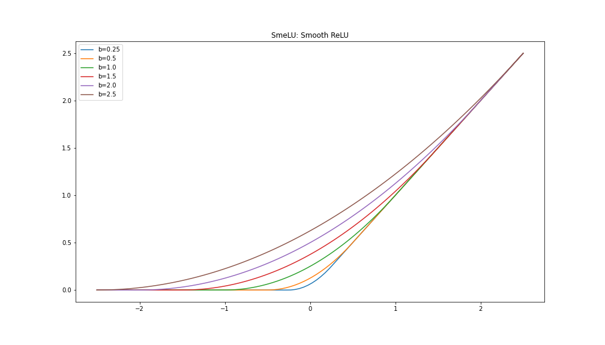

# Tensorflow Extra
> Extra Utilities for Tensorflow

# Installation
For Stable version
```shell
!pip install tensorflow-extra
```
or
For updated version
```shell
!pip install git+https://github.com/awsaf49/tensorflow_extra
```
# Layers
## MelSpectrogram
Converts audio data to mel-spectrogram in GPU/TPU.
```py
import tensorflow_extra as tfe
audio2spec = tfe.layers.MelSpectrogram()
spec = audio2spec(audio)
```

## Time Frequency Masking
Can also control number of stripes.
```py
time_freq_mask = tfe.layers.TimeFreqMask()
spec = time_freq_mask(spec)
```

## CutMix & MixUp
Can be used with audio, spec, image. For spec full freq resolution can be used using `full_height=True`.
```py
cutmix = tfe.layers.CutMix()
mixup = tfe.layers.MixUp()
audio = cutmix(audio, training=True) # accepts both audio & spectrogram
audio = mixup(audio, training=True)
```

## Normalization
Applies standardization and rescaling.
```py
norm = tfe.layers.ZScoreMinMax()
spec = norm(spec)
```

# Activations
## SmeLU: Smooth ReLU
```py
import tensorflow as tf
import tensorflow_extra as tfe

a = tf.constant([-2.5, -1.0, 0.5, 1.0, 2.5])
b = tfe.activations.smelu(a)  # array([0., 0.04166667, 0.6666667 , 1.0416666 , 2.5])
```

